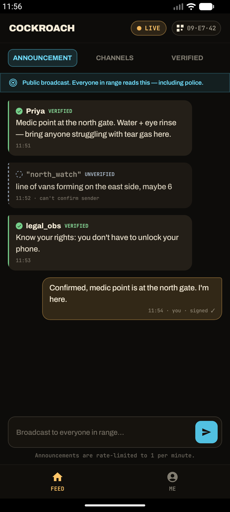
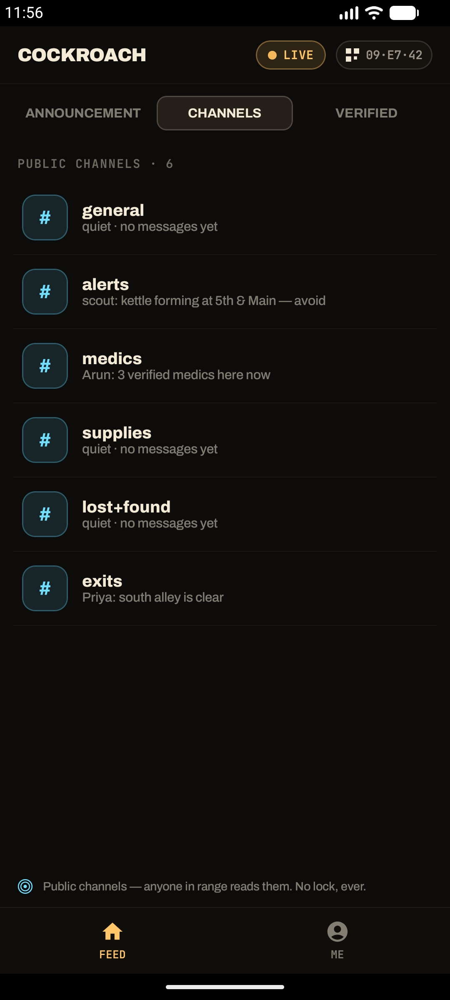
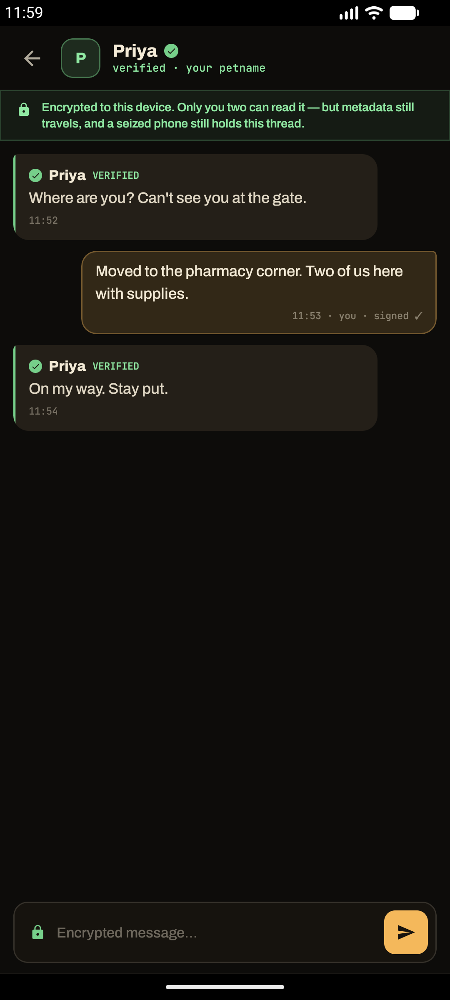
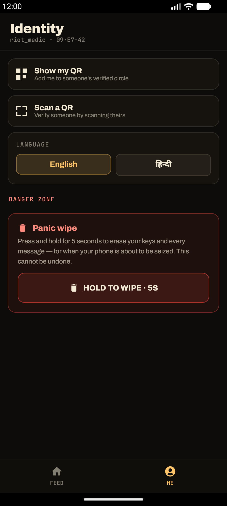

# 🪳 Cockroach Chat

**You cannot squash a signal.**

A decentralized, serverless, peer-to-peer messenger that works entirely over **Bluetooth LE —
no internet, no cell, no servers, no accounts.** Built for protests, disasters, and network
blackouts. Named for the thing that survives when the lights go out.

Every phone is both a client and a relay. Messages hop phone-to-phone across a dense crowd, so
the network exists only as long as people's radios are on — and it belongs to no one.

> ## ⚠️ NOT AUDITED — do not rely on this where your safety depends on it
>
> This software has had **no external security audit**. The crypto is vetted (Noise via `snow`,
> ed25519-dalek, SQLCipher) and there is a written threat model, but nobody independent has
> reviewed the result. It also **cannot make you anonymous over the air** — a co-located radio
> observer can correlate timing and signal strength no matter what we encrypt.
>
> **Read [`docs/threat-model.md`](docs/threat-model.md) before trusting this with anything.**
> An external audit before we promote it for real protest use is a commitment, not an aspiration.

**Status: 🚧 In active development. Android only.** Validated on Android hardware
(Galaxy S23 ↔ OnePlus). Built in the open — see [contributing](CONTRIBUTING.md) and the
[threat model](docs/threat-model.md).

---

## Screens

Android · dark · English / हिन्दी.

| Announcement | Channels | Encrypted DM | Me |
|:---:|:---:|:---:|:---:|
|  |  |  |  |

---

## Field principles

The whole app is built to these:

1. **Never fake trust. Never fake connectivity.** If we're unsure, the UI says unsure.
2. **Glanceable in sun or dark, one hand, under duress.**
3. **A field radio, not a social app.**
4. **Screen on = you carry the network.**

---

## What works today

Proven on real hardware (Galaxy S23 ↔ OnePlus, airplane mode):

- **Two phones chat offline over BLE** — discover, connect (dual central + peripheral GATT),
  relay, and exchange messages with **no internet**, each one Ed25519 signature-verified.
- **Always-on relay** — the mesh runs in a foreground service, so it keeps carrying messages
  when the app is backgrounded or the screen is locked. Battery-aware: drops to low-power BLE
  scanning/advertising when idle.
- **Public channels** — ownerless, join-by-name (`#general`, `#alerts`, `#medics`, `#supplies`,
  `#lost+found`, `#exits`), treated honestly as **public squares** (anyone in range can read,
  including police). The Announcement broadcast is rate-limited to 1/min; channels to 2/10s.
- **End-to-end encrypted DMs** — Noise XX with **MITM-binding** (the encrypted session must match
  the peer's announced key). Handshakes retry until they land, so DMs deliver reliably.
- **In-person verification** — scan a peer's QR fingerprint; a 4-word **safety number** to compare
  out loud; assign a private petname. Verifying establishes the session so **both phones flip to
  verified immediately**. A stranger can't DM you without a scan.
- **Panic wipe** — press-and-hold to cryptographically erase keys + the encrypted database
  (hardware-key erasure via Android Keystore). No backup exists anywhere.
- **Forensics-resistant at rest** — messages and identity live in a **SQLCipher** database keyed
  by a hardware-wrapped key; `FLAG_SECURE` blocks screenshots and the recents thumbnail.
- **Bilingual UI** — English and **हिन्दी** (Hindi), switchable in-app, chosen at first run.

**Core:** the Rust `meshcore` is green — 57 unit tests + 10 deterministic simulator scenarios
(broadcast to 200 nodes, partition heal, duplicate-storm suppression, malicious-flooder
containment, multi-hop relay, store-and-forward, DM handshake retry, and more).

---

## How it works

The protocol lives in one place, so the platform shell owns only the radio and the screen:

```
                ┌──────────────────────────────┐
                │  Android (Kotlin / Compose)  │
                │  BLE GATT radio · UI only    │
                └───────────────┬──────────────┘
                                │  UniFFI (meshcore-ffi)
                                ▼
        ┌───────────────────────────────────────────────┐
        │   meshcore  — pure sans-IO Rust core           │
        │   wire codec · fragmentation · identity + PoW  │
        │   flooding relay (TTL/jitter/suppression/dedup │
        │   /rate-limit) · channels + GCS sync · Noise   │
        │   XX DMs · store-and-forward · SQLCipher store │
        └───────────────────────────────────────────────┘
```

The core is **sans-IO**: no threads, no sockets, no clock syscalls. Time, transport, and storage
are injected, which is what makes hundreds of virtual nodes replayable in a deterministic
simulator. The native shell owns only the BLE radio and the screen.

### Repo layout

| Path | What |
|---|---|
| `crates/meshcore` | The protocol/crypto/mesh core (sans-IO, no platform deps). |
| `crates/meshcore-store` | SQLCipher-backed encrypted persistence (`Store` trait). |
| `crates/meshcore-ffi` | UniFFI wrapper → Kotlin bindings. |
| `crates/sim` | Desktop simulator: deterministic scenarios over virtual radios. |
| `android/` | Android app (Jetpack Compose, JNA, ZXing). |
| `docs/` | Plan, protocol, progress ledger, ADRs, research brief. |

---

## Honest limits

- **Local clusters, ~50–500 people in physical proximity** — not city-scale realtime chat. BLE
  physics (5–8 reliable links/phone, limited airtime) doesn't allow it, and we don't pretend it does.
- **Android only.** There is no iOS app, and iPhones cannot join the mesh at all. In a mixed crowd
  that is a large fraction of people you simply cannot reach. iOS is deferred, not planned — see
  [`ROADMAP.md`](ROADMAP.md).
- **The network needs radios on.** The mesh exists only while people's screens are on and the app
  is relaying; the UI is honest that screen-on carries the mesh.
- **Public channels are public.** Anyone in radio range reads them — there is no lock, ever.
- **Not yet audited.** The crypto is vetted (Noise via `snow`, ed25519-dalek, SQLCipher), but this
  has **not** had an external security audit. Don't bet a life on it yet.

See `docs/research-brief.md` for the constraints and prior-art lessons everything is built on.

---

## Build & run

**Rust core (any desktop):**

```bash
cargo test --workspace                                   # 57 unit tests + scenarios
cargo run -p sim -- --nodes 200 --scenario broadcast     # deterministic mesh sim
```

**Android app** (needs Rust stable + `aarch64-linux-android` / `armv7-linux-androideabi` /
`x86_64-linux-android` targets, Android SDK + NDK, and a JDK 17+):

```bash
# 1. Cross-compile the Rust core to the 3 ABIs and (re)generate Kotlin bindings
ANDROID_NDK_HOME=~/Library/Android/sdk/ndk/<version> ./scripts/build-android-lib.sh

# 2. Build + install (JAVA_HOME must point at a JDK 17+, e.g. Android Studio's JBR)
cd android && ./gradlew installDebug
```

The `.so` libraries, JNA, and generated UniFFI bindings are packaged into the APK automatically.
Real BLE needs a **physical phone** (emulators have no Bluetooth radio).

---

## Docs

| File | What |
|---|---|
| `docs/IMPLEMENTATION_PLAN.md` | Full plan: architecture, milestones M0–M6, protocol, security. |
| `docs/PROGRESS.md` | Live build ledger — what's done, what's next. |
| `docs/protocol.md` | Normative wire format. |
| `docs/PERFORMANCE.md` | Performance backlog and tuning notes. |
| `docs/threat-model.md` | **What this protects against — and what it doesn't.** Read first. |
| `docs/research-brief.md` | The constraints and prior-art lessons everything is built on. |
| `docs/decisions/` | Architecture decision records. |
| `docs/ai-build-loop.md` | The agent prompt this was built with (see below). |

---

## How this was built

Most of this codebase was written by an AI agent running an iterative build loop — the prompt that
drove it is in [`docs/ai-build-loop.md`](docs/ai-build-loop.md), and `docs/PROGRESS.md` is the
resulting task-by-task ledger.

That's worth stating plainly rather than leaving you to guess, because it should change how you read
the code. Every change was gated on `cargo test --workspace`, `cargo clippy -- -D warnings`, and the
deterministic simulator scenarios, and the BLE and UI work was verified on physical phones — but
**this has had far fewer human eyes on it than a security tool deserves.** That is precisely why
the threat model is blunt, why unaudited is stated loudly, and why review contributions are the most
valuable thing anyone can offer right now.

---

## Contributing

Contributions are very welcome — especially **security review** and **hardware reports** from
Android device combinations we don't own.

- [`CONTRIBUTING.md`](CONTRIBUTING.md) — setup, the project invariants, how to run the simulator
- [`ROADMAP.md`](ROADMAP.md) — what's done, what's next, what we're deliberately not building
- [`GOVERNANCE.md`](GOVERNANCE.md) — how decisions get made, how to become a maintainer
- [`SECURITY.md`](SECURITY.md) — **report vulnerabilities privately**, never in a public issue
- [`CODE_OF_CONDUCT.md`](CODE_OF_CONDUCT.md)

Good first issues are labelled [`good first issue`](https://github.com/xdadwal/cockroach-chat/labels/good%20first%20issue);
several come straight out of [`docs/PERFORMANCE.md`](docs/PERFORMANCE.md).

---

## License

MIT — see [`LICENSE`](LICENSE). Bundled fonts and dependencies carry their own terms; see
[`NOTICE.md`](NOTICE.md).

<br>

> *Together we survive. Radios on, mesh alive. Verify in person.*
