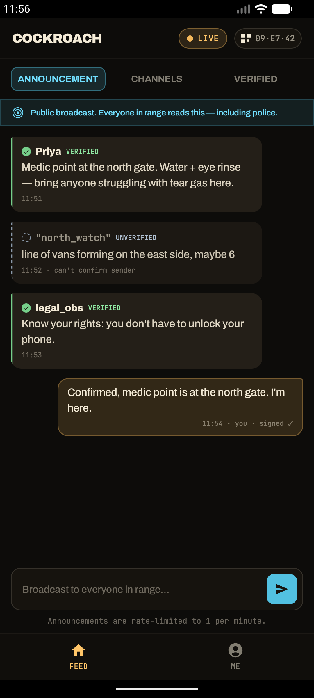
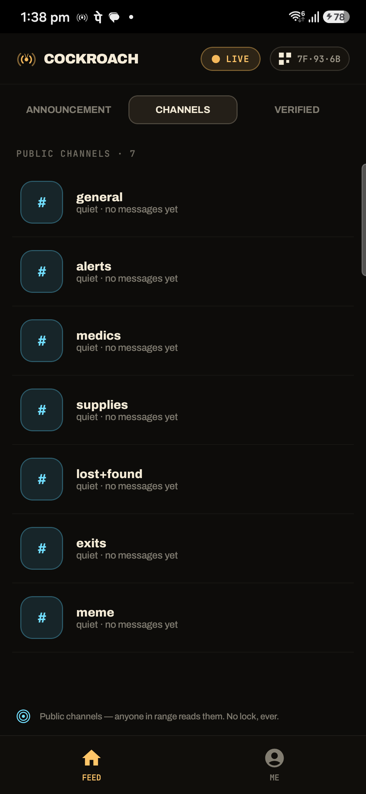
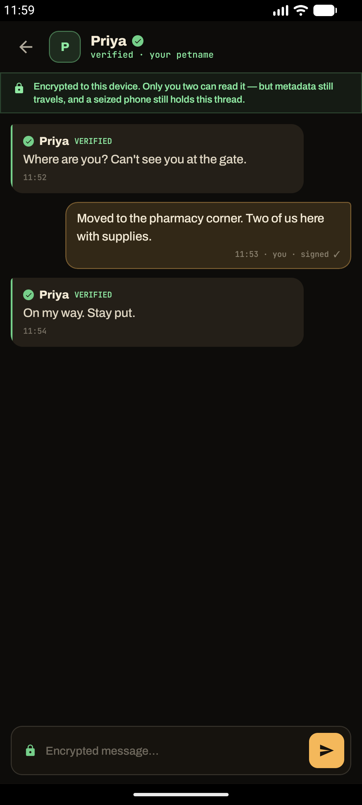
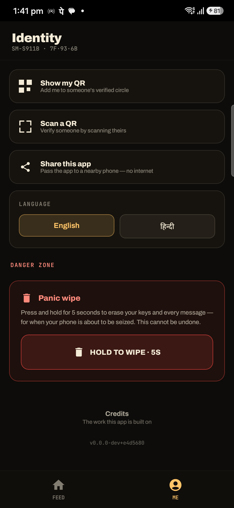

# Cockroach Chat

**An educational experiment in Bluetooth mesh messaging.**

Cockroach Chat is developed and published solely for **education, research, and controlled
experimentation** with peer-to-peer messaging over Bluetooth LE. It explores local message
relay and encrypted sessions without an internet connection, cellular service, or user accounts.
It is **not intended for emergency, disaster-response, personal-safety, or other critical use**.

Participating phones can act as clients and relays. Message forwarding depends on nearby
participating devices and available radio links.

**[Download the Android APK (v0.1.0)](https://github.com/xdadwal/cockroach-chat/releases/download/v0.1.0/cockroach-chat-0.1.0.apk)**
· [All releases and checksums](https://github.com/xdadwal/cockroach-chat/releases)

## Install for experimentation on Android

Requires **Android 8.0 or newer**. The APK supports ARM64, 32-bit ARM, and x86_64 devices.

1. Open the download link above on your phone and download `cockroach-chat-0.1.0.apk`.
2. Open the downloaded file. If Android asks, allow **Install unknown apps** for the browser
   or file manager you used, then tap **Install**. You can turn that permission off afterward.
3. Open Cockroach Chat, turn on Bluetooth, and grant the permissions requested for nearby discovery.
   Nearby users also need the app installed to chat over the mesh.

Future releases signed with the same release key can update the app in place. A development APK
uses a different signing key: Android cannot replace it with this release. Uninstalling it first
erases its local identity and messages, so only do that if you are ready to lose that data.

The release includes `SHA256SUMS`; see [SECURITY.md](SECURITY.md#verifying-a-release) for checksum
and signing-certificate verification. The app is under active development and unaudited; read
the limitations below before experimenting with it.

> ## Educational prototype — unaudited and provided as-is
>
> This software is an experiment, not a safety or emergency communications service.
> It is supplied without warranty under the [MIT License](LICENSE). Read the
> [educational-purpose and non-endorsement notice](DISCLAIMER.md).
> Use only in lawful, authorized experiments with consenting participants.
>
> **It may not work as expected.** Especially in dense crowds, heavy interference or jamming, on
> low battery, or on Android builds we've never seen. Delivery is best-effort — a message that
> looks sent may never arrive. **Do not rely on it for safety or essential communications.**
>
> **It cannot make you anonymous.** Encryption protects what you say, not the fact that a radio
> near you is speaking. A co-located observer can correlate timing and signal strength no matter
> what we encrypt.
>
> **The implementation is unaudited.** It uses established libraries (Noise via `snow`, ed25519-dalek,
> SQLCipher) and there's a written threat model, but nobody independent has reviewed how we put
> them together.
>
> **Read [`docs/threat-model.md`](docs/threat-model.md) for the limitations of the experiment.**

**Status: 🚧 Experimental. Android only.** Previous project testing used Android hardware
(Galaxy S23 ↔ OnePlus); this is not certification or evidence of performance in other conditions.
See [contributing](CONTRIBUTING.md) and the [threat model](docs/threat-model.md).

---

## Screens

Earlier prototype screenshots · Android · dark · English / हिन्दी.

| Announcement | Channels | Encrypted DM | Me |
|:---:|:---:|:---:|:---:|
|  |  |  |  |

---

## Design principles

The whole app is built to these:

1. **Never fake trust. Never fake connectivity.** If we're unsure, the UI says unsure.
2. **Readable controls and visible connection state.**
3. **A small, inspectable mesh-network experiment.**
4. **Participation depends on device, radio, and operating-system behavior.**

---

## Implemented features

These features have project tests and limited hardware observations, not an independent audit
or a guarantee of delivery, security, or suitability:

- **Two phones chat offline over BLE** — discover, connect (dual central + peripheral GATT),
  relay, and exchange messages with **no internet**, each one Ed25519 signature-verified.
- **Background relay** — the mesh runs in a foreground service, so it keeps carrying messages
  when the app is backgrounded or the screen is locked. Battery-aware: drops to low-power BLE
  scanning/advertising when idle.
- **Public channels** — ownerless, join-by-name (`#general`, `#alerts`, `#medics`, `#supplies`,
  `#lost+found`, `#exits`), treated honestly as **public squares** (anyone in range can read,
  including unintended recipients). The Announcement broadcast is rate-limited to 1/min;
  channels to 2/10s.
- **End-to-end encrypted DMs** — Noise XX with **MITM-binding** (the encrypted session must match
  the peer's announced key). Handshakes use bounded retries; delivery can still fail.
- **In-person verification** — scan a peer's QR fingerprint; a 4-word **safety number** to compare
  out loud; assign a private petname. Verification is designed to bind a peer to the scanned
  fingerprint. It does not prove a person's legal identity or guarantee that their device is
  uncompromised.
- **Local wipe** — press-and-hold to remove local key material and the encrypted database.
  It cannot delete recipients' copies or guarantee forensic erasure on every device.
- **Encrypted local storage** — messages and identity live in a **SQLCipher** database keyed
  by a hardware-wrapped key; `FLAG_SECURE` requests screenshot and recents protection.
  Neither is a guarantee against device compromise.
- **Bilingual UI** — English and **हिन्दी** (Hindi), switchable in-app, chosen at first run.

**Core tests** cover protocol behavior and deterministic simulator scenarios, including
broadcast to 200 simulated nodes, partition recovery, duplicate suppression, multi-hop relay,
and DM handshake retries. Simulation results do not establish real-world capacity or safety.

---

## How it works

The protocol lives in one place, so the platform shell owns only the radio and the screen:

```
                ┌──────────────────────────────┐
                │  Android (Kotlin / Compose)  │
                │  BLE GATT radio · UI only    │
                └───────────────┬──────────────┘
                                │  UniFFI (meshcore-ffi)
                                ▼
        ┌───────────────────────────────────────────────┐
        │   meshcore  — pure sans-IO Rust core           │
        │   wire codec · fragmentation · identity + PoW  │
        │   flooding relay (TTL/jitter/suppression/dedup │
        │   /rate-limit) · channels + GCS sync · Noise   │
        │   XX DMs · store-and-forward · SQLCipher store │
        └───────────────────────────────────────────────┘
```

The core is **sans-IO**: no threads, no sockets, no clock syscalls. Time, transport, and storage
are injected, which is what makes hundreds of virtual nodes replayable in a deterministic
simulator. The native shell owns only the BLE radio and the screen.

### Repo layout

| Path | What |
|---|---|
| `crates/meshcore` | The protocol/crypto/mesh core (sans-IO, no platform deps). |
| `crates/meshcore-store` | SQLCipher-backed encrypted persistence (`Store` trait). |
| `crates/meshcore-ffi` | UniFFI wrapper → Kotlin bindings. |
| `crates/sim` | Desktop simulator: deterministic scenarios over virtual radios. |
| `android/` | Android app (Jetpack Compose, JNA, ZXing). |
| `docs/` | Plan, protocol, progress ledger, ADRs, research brief. |

---

## Honest limits

- **Local experiments only.** The design explores nearby clusters, not city-scale realtime chat.
  Earlier estimates of 50–500 participants are design targets, not validated capacity claims.
- **Android only.** There is no iOS app, and iPhones cannot join the mesh at all. In a mixed crowd
  that is a large fraction of people you simply cannot reach. iOS is deferred — see
  [`CONTRIBUTING.md`](CONTRIBUTING.md).
- **The network needs participating devices.** Radios, operating-system restrictions, battery
  state, and app lifecycle all affect whether a device can relay.
- **Public channels are public.** Anyone in radio range reads them — there is no lock, ever.
- **Not yet audited.** Using cryptographic libraries does not establish that their integration is
  secure. This implementation has **not** had an external security audit.
- **Delivery is best-effort.** No acknowledgements, no guaranteed ordering, no retry forever. A
  message that looks sent may never arrive, and under interference or jamming the mesh may not work
  at all. Never treat "sent" as "delivered" for anything that matters.

See `docs/research-brief.md` for the constraints and prior-art lessons everything is built on.

### Educational purpose and independence

This project is published for learning and controlled experimentation. It does not promote or
endorse any political movement, campaign, organization, unlawful activity, or particular
real-world deployment. References to other projects, companies, devices, and trademarks identify
technologies or provide attribution; they do not imply affiliation, sponsorship, or endorsement.

The [full notice](DISCLAIMER.md) explains the intended purpose, limits, and relationship to the
MIT license. This purpose statement does not add restrictions to the permissions in that license.

### Open research and assurance gaps

- **An external security audit.** None has been completed; no date or outcome is promised.
- **Sustained fuzzing.** Targets exist for the three parsers, but CI runs them 60 s each on PRs:
  regression detection, not a search for new bugs. The Noise handshake and store have no targets.
- **Reproducible builds**, so a release binary can be checked against source rather than trusted.

---

## Build & run

**Rust core (any desktop):**

```bash
cargo test --workspace                                   # unit tests + scenarios
cargo run -p sim -- --nodes 200 --scenario broadcast     # deterministic mesh sim
```

**Android app** (needs Rust stable + `aarch64-linux-android` / `armv7-linux-androideabi` /
`x86_64-linux-android` targets, Android SDK + NDK, and a JDK 17+):

```bash
# 1. Cross-compile the Rust core to the 3 ABIs and (re)generate Kotlin bindings
ANDROID_NDK_HOME=~/Library/Android/sdk/ndk/<version> ./scripts/build-android-lib.sh

# 2. Build + install (JAVA_HOME must point at a JDK 17+, e.g. Android Studio's JBR)
cd android && ./gradlew installDebug
```

The `.so` libraries, JNA, and generated UniFFI bindings are packaged into the APK automatically.
Real BLE needs a **physical phone** (emulators have no Bluetooth radio).

---

## Docs

| File | What |
|---|---|
| `DISCLAIMER.md` | Educational purpose, non-endorsement, and warranty notice. |
| `docs/IMPLEMENTATION_PLAN.md` | Full plan: architecture, milestones M0–M6, protocol, security. |
| `docs/PROGRESS.md` | Live build ledger — what's done, what's next. |
| `docs/protocol.md` | Normative wire format. |
| `docs/PERFORMANCE.md` | Performance backlog and tuning notes. |
| `docs/threat-model.md` | **Security design assumptions and limitations.** Read first. |
| `docs/research-brief.md` | The constraints and prior-art lessons everything is built on. |
| `docs/decisions/` | Architecture decision records. |
| `docs/ai-build-loop.md` | The agent prompt this was built with (see below). |

---

## How this was built

Most of this codebase was written by an AI agent running an iterative build loop — the prompt that
drove it is in [`docs/ai-build-loop.md`](docs/ai-build-loop.md), and `docs/PROGRESS.md` is the
resulting task-by-task ledger.

That's worth stating plainly rather than leaving you to guess, because it should change how you read
the code. The project uses automated tests, Clippy, deterministic simulator scenarios, and limited
physical-phone checks. These checks do not establish security or fitness for a particular use;
**this has had far fewer human eyes on it than a security tool deserves.** That is precisely why
the threat model is blunt, why unaudited is stated loudly, and why review contributions are the most
valuable thing anyone can offer right now.

---

## Contributing

Contributions are very welcome — especially **security review** and **hardware reports** from
Android device combinations we don't own.

- [`CONTRIBUTING.md`](CONTRIBUTING.md) — setup, the project invariants, review rules, what's out of
  scope
- [`SECURITY.md`](SECURITY.md) — **report vulnerabilities privately**, never in a public issue
- [`CODE_OF_CONDUCT.md`](CODE_OF_CONDUCT.md)

Good first issues are labelled [`good first issue`](https://github.com/xdadwal/cockroach-chat/labels/good%20first%20issue);
several come straight out of [`docs/PERFORMANCE.md`](docs/PERFORMANCE.md).

---

## Credits

This project stands on other people's work.

**Type.** The interface is set in two typefaces, both used unmodified under the
[SIL Open Font License 1.1](https://openfontlicense.org):

- **[Archivo](https://github.com/Omnibus-Type/Archivo)** — carries the voice. By
  [Omnibus-Type](https://www.omnibus-type.com), designed by Hector Gatti.
- **[JetBrains Mono](https://github.com/JetBrains/JetBrainsMono)** — carries the fact: fingerprints,
  safety numbers, IDs. By [JetBrains](https://www.jetbrains.com), designed by Philipp Nurullin and
  Konstantin Bulenkov.

**Cryptography.** We hand-roll nothing. The security of this app rests on
[`snow`](https://github.com/mcginty/snow) (Noise protocol),
[`ed25519-dalek` and `x25519-dalek`](https://github.com/dalek-cryptography),
the [RustCrypto](https://github.com/RustCrypto) family, and
[SQLCipher](https://www.zetetic.net/sqlcipher/). Their use is technical attribution, not an endorsement or security guarantee.

**Prior art.** The historical [research brief](docs/research-brief.md) cites other mesh and
messaging projects. These references are for study and do not imply association or endorsement.

Third-party notice index: [`NOTICE.md`](NOTICE.md).

---

## License

MIT — see [`LICENSE`](LICENSE), including its warranty disclaimer and limitation of liability.
The educational purpose statement does not replace or narrow the MIT permissions. Bundled fonts
and dependencies carry their own terms; see [`NOTICE.md`](NOTICE.md).

<br>

> *Study the protocol. Test the assumptions. Understand the limits.*
